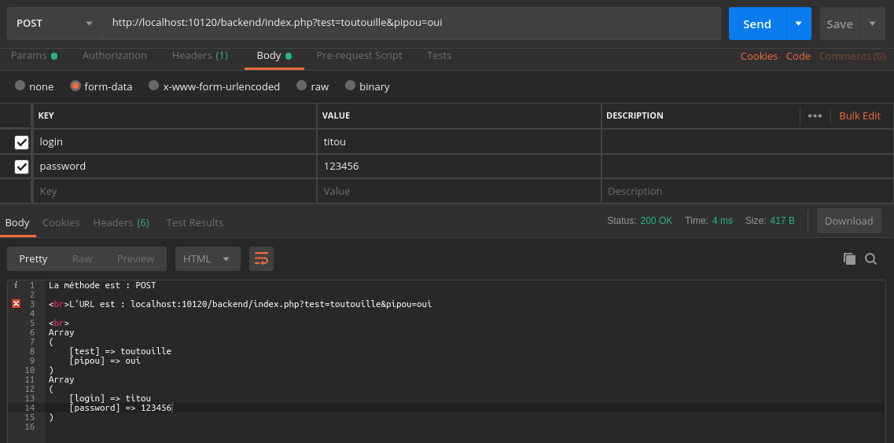

# Traiter des requêtes HTTP avec PHP

On a dit qu'une requête HTTP est essentiellement composée de :

- un verbe
- une URL (avec des query params éventuels)
- des headers
- un body

On peut fabriquer une requête touchant à tout ceci dans Postman. Par exemple la requête ci-dessous :



Cette requête au format cURL :

```bash
curl -X POST \
  'http://localhost:10120/backend/index.php?test=toutouille&pipou=oui' \
  -H 'Content-Type: application/x-www-form-urlencoded' \
  -H 'Postman-Token: 427bd6b1-bc2a-402b-9e5d-f65513d6b3e5' \
  -H 'cache-control: no-cache' \
  -H 'content-type: multipart/form-data; boundary=----WebKitFormBoundary7MA4YWxkTrZu0gW' \
  -F login=titou \
  -F password=123456
```

Ou encore avec fetch en JavaScript :

TODO: mettre ici le code de cette requête format fetch.

## Traiter ce type de requêtes avec PHP

### Le verbe

On l'obtient facilement avec `$_SERVER['REQUEST_METHOD']`. Il n'y a pas grand chose de plus à dire ici :).

### L'URL

On peut probablement la récupérer en un seul morceau mais je n'ai pas trouvé comment.
On peut aussi la récupérer en concaténant l'adresse du serveur (host) avec l'URI :

```php
echo $_SERVER['HTTP_HOST'] . $_SERVER['REQUEST_URI'];
```

Dans l'URL tout ce qui se trouve après un `?` est considéré comme des paramètres (query params). Vous pouvez y accéder à l'aide de la variable `$_GET`, par exemple :

```php
// http://localhost:10120/backend/index.php?test=toutouille&pipou=oui
echo $_GET['test'];
echo $_GET['pipou'];
```

### Les headers

TODO: rédiger cette partie

### Le contenu (body)

On y accède de la même façon que les query params, mais avec `$_POST` au lieu de `$_GET`. Par exemple, en reprenant notre requête Postman du début :

```php
// http://localhost:10120/backend/index.php?test=toutouille&pipou=oui
echo $_POST['login'];
echo $_POST['password'];
```

C'est par exemple de cette manière que l'on reçoit en général les données d'un formulaire. Libre à nous par la suite d'en faire ce que l'on veut.
